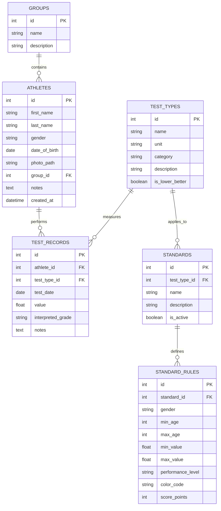

# FITTEST+ Architecture and Implementation Plan

FITTEST+ is a professional desktop fitness assessment management system designed for sports scientists, coaches, educators, and trainers. This document provides the high-level system architecture, folder structure, database schema, UI layouts, and a development roadmap.

## Open Questions

> [!WARNING]
> Please review and provide feedback on the following design choices:
>
> 1. **Charting Library**: Should we use `PySide6.QtCharts` (native Qt charts, high performance) or `matplotlib` (highly customizable, very mature plotting, standard in scientific Python)?
> 2. **Report PDF/Excel Generation**: For PDF export, `reportlab` is standard but requires programmatic canvas drawing. Would you prefer using `weasyprint` (HTML to PDF) for easier templating, or is `reportlab` preferred? For Excel export, is `openpyxl` sufficient?
> 3. **Storage & Portability**: Where should the default database and athlete photo directory reside? We propose checking a user-configurable location, defaulting to the user's `Documents/FITTEST+` folder for easy backup and portability.

## System Overview & Key Design Decisions

The application requires modularity, scalability, and the ability to add new fitness tests dynamically without database schema migrations. To achieve these goals, we propose the following design choices:

1. **Architecture Pattern**: **Model-View-Controller (MVC)** with dedicated Service and Repository layers. This separates database entities (Models), UI layout/presentation (Views), coordination logic (Controllers), and complex business operations (Services).
2. **Extensible Schema**: To support arbitrary test types and standards without database schema alterations, we use a metadata-driven approach. A `test_types` table defines the tests, and a `standard_rules` table defines gender- and age-specific interpretation thresholds. 
3. **Local Database**: SQLite is selected for its portability and zero-configuration setup, making it ideal for desktop applications deployed in schools and fitness centers. SQLAlchemy ORM provides clean model mapping and migration compatibility.
4. **Modern UI Aesthetics**: PySide6 (Qt for Python) with custom styles, responsive layouts, sidebar navigation, and dynamic status badges to deliver a premium user experience.

---

## 1. Directory Structure

Below is the proposed modular directory structure, keeping dependencies clean and isolating frontend layouts from business logic.

```text
fittest/
├── app/
│   ├── __init__.py
│   ├── config.py           # Application config, constants, database paths
│   ├── core/               # Shared utilities and system core
│   │   ├── __init__.py
│   │   ├── db.py           # SQLAlchemy engine & session management
│   │   └── security.py     # Local password/settings hashing if needed
│   ├── models/             # Database ORM Models (Model layer)
│   │   ├── __init__.py
│   │   ├── athlete.py      # Athlete profiles & demographics
│   │   ├── group.py        # Team/Group definitions
│   │   ├── test_type.py    # Test type metadata (units, metrics)
│   │   ├── record.py       # Specific test records/results
│   │   └── standard.py     # Standard scales and grading rules
│   ├── services/           # Business Logic Layer (Interpreters, Exporters)
│   │   ├── __init__.py
│   │   ├── interpreter.py  # Grading logic engine
│   │   ├── exporter.py     # PDF & Excel report engines
│   │   └── importer.py     # Standards JSON/CSV parser
│   ├── controllers/        # Application Controller/Presenter Layer
│   │   ├── __init__.py
│   │   ├── athlete_controller.py
│   │   ├── record_controller.py
│   │   ├── standard_controller.py
│   │   └── analysis_controller.py
│   └── views/              # PySide6 Layouts and Widgets (View layer)
│       ├── __init__.py
│       ├── main_window.py  # Application shell / primary layout
│       ├── components/     # Reusable custom UI components
│       │   ├── __init__.py
│       │   ├── cards.py    # Visual metric display widgets
│       │   ├── charts.py   # Integrated QtCharts / Matplotlib wrappers
│       │   ├── badges.py   # Colored interpretation status markers
│       │   └── inputs.py   # Custom combo-boxes, photo pickers
│       ├── dashboard/      # Main dashboard content widget
│       ├── athlete/        # Athlete list, detail, and editor UI
│       ├── test_entry/     # Fast data-entry sheet/form
│       ├── standards/      # Reference norms manager interface
│       ├── analysis/       # Team statistics and cross-rankings panel
│       └── reports/        # Export configuration UI
├── tests/                  # Automated Unit and Integration Tests
│   ├── __init__.py
│   ├── test_models.py
│   ├── test_interpreter.py
│   └── test_exporter.py
├── assets/                 # Embedded graphic files, icons, sample data
│   ├── icons/
│   └── samples/
├── requirements.txt        # PIP dependencies
└── main.py                 # Application execution entry point
```

---

## 2. Database Schema

The database relies on SQLAlchemy ORM to manage state and relational queries.



### Key Schema Entities & Attributes:
1. **`athletes`**: Stores profile information. Includes reference to a local image path (`photo_path`) and references `groups` for division grouping.
2. **`test_types`**: Stores core metadata for test types (e.g., "VO2max", "Sit and Reach").
   - `is_lower_better` determines ranking order (e.g., lower running times are better; higher grip strength is better).
3. **`test_records`**: Stores individual records of a test execution. It links a specific `athlete` and `test_type` to a numerical float `value`. The `interpreted_grade` caches the evaluated performance band (e.g., "Excellent") to speed up bulk lists.
4. **`standards`**: Represents a container for a norm set (e.g., "ACSM Guidelines 2026"). Allows selecting which standard set is currently active for interpretation.
5. **`standard_rules`**: Stores individual rule parameters.
   - `gender` can be 'M', 'F', or 'All'.
   - `min_age` and `max_age` represent the age bracket inclusive.
   - `min_value` and `max_value` represent the performance thresholds (NULL indicates negative/positive infinity respectively).
   - `color_code` holds a hex color string (e.g., `#2ECC71` for Excellent, `#E74C3C` for Poor) mapping the range directly to the UI.

---

## 3. UI Wireframe & Layout Design

The user interface will be built using clean, responsive PySide6 layouts. It uses a **Single Page Application (SPA)** model utilizing a layout containing a persistent sidebar and a stacked widget.

### Main Dashboard Wireframe Concept:
```text
+------------------------------------------------------------------------------------+
|  FITTEST+ | Dashboard                                              [Active DB: ok] |
+------------------------------------------------------------------------------------+
| (o) Dashboard   |  +------------------+  +------------------+  +-----------------+ |
|                 |  | Total Athletes   |  | Total Tests      |  | Active Standard | |
| [ ] Athletes    |  |       142        |  |      1,829       |  |  ACSM 2026 V1   | |
|                 |  +------------------+  +------------------+  +-----------------+ |
| [*] Test Entry  |                                                                  |
|                 |  +----------------------------------+ +------------------------+ |
| [=] Standards   |  | Recent Assessments               | | Test Breakdown         | |
|                 |  | Date       Name       Test       | |                        | |
| [v] Group Anal. |  | 06-02-2026 John Doe   VO2max     | |   [Excellent]  ==== 45%| |
|                 |  | 06-02-2026 Jane Smith Grip Str.  | |   [Good]       ==== 30%| |
| [^] Reports     |  | 06-01-2026 Bob Johnson Push Ups  | |   [Average]    == 15%  | |
|                 |  | 06-01-2026 Alice White Run 12m   | |   [Poor]       = 10%   | |
|                 |  +----------------------------------+ +------------------------+ |
+------------------------------------------------------------------------------------+
```

### Core Views Layout:

1. **Athlete Management View**:
   - **Left Panel**: Search bar + Group filter + List of Athletes (Table/Grid layout).
   - **Right Panel**: Full profile. Displays photo (or default silhouette), Name, DOB, Age, Gender, Group, and a tab widget:
     - *Tab 1 (Bio)*: Form fields to edit demographic info.
     - *Tab 2 (Records)*: Timeline table of all historic test results with interpretation badges.
     - *Tab 3 (Progress Charts)*: Plotting historical results of selected tests over time using PySide6.QtCharts or Matplotlib.

2. **Standards Management View**:
   - **Left Panel**: Directory tree of test types. Clicking a test type displays all configured standards.
   - **Right Panel**: Standard details editor. Shows table containing rules (Min Age, Max Age, Gender, Ranges).
   - **Controls**: "New Standard", "Delete Standard", "Import Standards (JSON/CSV)", "Export Standards".

3. **Fast Test Entry View**:
   - Designed for speed in field environments.
   - Select group -> Select Athlete -> Select Test Type.
   - **Result Entry Input**: Focus lands directly on a validated decimal/spin input.
   - **Automatic Live Interpretation Pane**: As numbers are typed, a real-time badge updates immediately showing the corresponding grade and colored category (e.g., `Good` in Green).
   - Pressing `Enter` saves the record, resets the input, and advances to the next athlete in the group.

4. **Group Analysis View**:
   - Comboboxes to select a Group/Team and a Test Type.
   - Metrics cards display: Group Size, Mean score, Median, Standard Deviation, Max, Min.
   - Bar chart compares top/bottom performers side-by-side.
   - Categorized distribution chart (pie chart / donut chart showing percentage of Excellent, Good, Average, etc.).

---

## 4. Core Classes Design

Here are the key object models and logic systems written in Python:

### A. ORM Models (SQLAlchemy)

```python
from datetime import datetime, date
from sqlalchemy import Column, Integer, String, Float, Date, DateTime, ForeignKey, Boolean, Text
from sqlalchemy.orm import declarative_base, relationship

Base = declarative_base()

class Group(Base):
    __tablename__ = 'groups'
    
    id = Column(Integer, primary_key=True)
    name = Column(String(100), nullable=False, unique=True)
    description = Column(Text, nullable=True)
    
    athletes = relationship("Athlete", back_populates="group")

class Athlete(Base):
    __tablename__ = 'athletes'
    
    id = Column(Integer, primary_key=True)
    first_name = Column(String(50), nullable=False)
    last_name = Column(String(50), nullable=False)
    gender = Column(String(10), nullable=False)  # 'Male', 'Female', 'Other'
    date_of_birth = Column(Date, nullable=False)
    photo_path = Column(String(255), nullable=True)
    group_id = Column(Integer, ForeignKey('groups.id'), nullable=True)
    notes = Column(Text, nullable=True)
    created_at = Column(DateTime, default=datetime.utcnow)
    
    group = relationship("Group", back_populates="athletes")
    records = relationship("TestRecord", back_populates="athlete", cascade="all, delete-orphan")

    @property
    def age(self) -> int:
        today = date.today()
        dob = self.date_of_birth
        return today.year - dob.year - ((today.month, today.day) < (dob.month, dob.day))

class TestType(Base):
    __tablename__ = 'test_types'
    
    id = Column(Integer, primary_key=True)
    name = Column(String(100), nullable=False, unique=True)
    unit = Column(String(20), nullable=False)       # e.g., 'mL/kg/min', 'cm', 'kg', '%'
    category = Column(String(50), nullable=False)   # e.g., 'Cardiovascular', 'Flexibility'
    description = Column(Text, nullable=True)
    is_lower_better = Column(Boolean, default=False) # e.g., True for timed sprints, False for jumps
    
    records = relationship("TestRecord", back_populates="test_type")
    standards = relationship("Standard", back_populates="test_type", cascade="all, delete-orphan")

class TestRecord(Base):
    __tablename__ = 'test_records'
    
    id = Column(Integer, primary_key=True)
    athlete_id = Column(Integer, ForeignKey('athletes.id'), nullable=False)
    test_type_id = Column(Integer, ForeignKey('test_types.id'), nullable=False)
    test_date = Column(Date, default=date.today, nullable=False)
    value = Column(Float, nullable=False)
    interpreted_grade = Column(String(50), nullable=True)
    notes = Column(Text, nullable=True)
    
    athlete = relationship("Athlete", back_populates="records")
    test_type = relationship("TestType", back_populates="records")

class Standard(Base):
    __tablename__ = 'standards'
    
    id = Column(Integer, primary_key=True)
    test_type_id = Column(Integer, ForeignKey('test_types.id'), nullable=False)
    name = Column(String(100), nullable=False)
    description = Column(Text, nullable=True)
    is_active = Column(Boolean, default=False)
    
    test_type = relationship("TestType", back_populates="standards")
    rules = relationship("StandardRule", back_populates="standard", cascade="all, delete-orphan")

class StandardRule(Base):
    __tablename__ = 'standard_rules'
    
    id = Column(Integer, primary_key=True)
    standard_id = Column(Integer, ForeignKey('standards.id'), nullable=False)
    gender = Column(String(10), nullable=False)      # 'Male', 'Female', 'All'
    min_age = Column(Integer, nullable=False)
    max_age = Column(Integer, nullable=False)
    min_value = Column(Float, nullable=True)         # NULL means -Infinity
    max_value = Column(Float, nullable=True)         # NULL means +Infinity
    performance_level = Column(String(50), nullable=False) # 'Excellent', 'Good', 'Average' etc.
    color_code = Column(String(7), nullable=False)   # Hex string: '#4CAF50'
    score_points = Column(Integer, default=0)        # Quantitative score representation
    
    standard = relationship("Standard", back_populates="rules")
```

### B. Business Logic Services

#### Interpreter Service
Determines performance level and scores based on configured active standards.

```python
class InterpreterService:
    def __init__(self, db_session):
        self.session = db_session
        
    def interpret(self, athlete: Athlete, test_type: TestType, value: float) -> dict:
        """
        Retrieves active standards for a given test type, parses rules 
        matching age and gender, and evaluates the performance tier.
        """
        # Find active standard
        active_standard = self.session.query(Standard).filter_by(
            test_type_id=test_type.id, is_active=True
        ).first()
        
        if not active_standard:
            return {"grade": "No Standard Active", "color": "#7F8C8D", "score": 0}
            
        athlete_age = athlete.age
        athlete_gender = athlete.gender
        
        # Query rules matching demographics
        rules = self.session.query(StandardRule).filter(
            StandardRule.standard_id == active_standard.id,
            StandardRule.gender.in_([athlete_gender, 'All']),
            StandardRule.min_age <= athlete_age,
            StandardRule.max_age >= athlete_age
        ).all()
        
        # Evaluate value ranges
        for rule in rules:
            min_ok = (rule.min_value is None) or (value >= rule.min_value)
            max_ok = (rule.max_value is None) or (value <= rule.max_value)
            if min_ok and max_ok:
                return {
                    "grade": rule.performance_level,
                    "color": rule.color_code,
                    "score": rule.score_points
                }
                
        return {"grade": "Unclassified", "color": "#95A5A6", "score": 0}
```

---

## 5. Development Roadmap

We propose a structured development flow across 5 phases.

### Phase 1: Environment & Core Data Layer (Weeks 1-2)
- Set up python project environment, Git, and virtual environments.
- Define SQLAlchemy models, run engine initializations, and build basic database seed files (preloading typical tests like BMI, VO2max, Sit & Reach, Grip Strength).
- Implement initial Unit tests for models.

### Phase 2: Core Services & Testing (Weeks 2-3)
- Write the `InterpreterService` and testing scenarios verifying interpretation ranges for different gender/age boundaries.
- Build standard import/export tools (implement standard JSON and CSV structure parsers).
- Set up unit testing pipelines with code coverage.

### Phase 3: Navigation Frame & Athlete Profile UI (Weeks 3-4)
- Create base PySide6 application frame (Main Window with custom side-dock navigation drawer).
- Implement Athlete Management module: views for list, profile card, dynamic avatar loading, search indexing, history views, and forms.
- Integrate CRUD capabilities for Athletes and Groups.

### Phase 4: Test Records & Standards UI (Weeks 4-5)
- Design and integrate the Fast Test Entry component: real-time validation, automatic interpreter badge reaction, and table indexing.
- Implement Standards configuration manager: layout with dynamic table adjustments, range rules editor, standard set picker.

### Phase 5: Group Analytics, Reports & Production Prep (Weeks 5-6)
- Build analysis widgets utilizing `PySide6.QtCharts` (or Matplotlib) displaying statistics and averages.
- Develop CSV/Excel exporter engine using `openpyxl` and PDF report card exporter using `reportlab`.
- Final system audits, code-linting, validation checks, and compiler packaging using `PyInstaller` (generating portable execution files).

## User Review Required

> [!IMPORTANT]
> The dynamic standards schema requires that standard ranges do not overlap. We will implement validation in the UI to prevent users from adding overlapping bounds within the same age/gender cohort.

> [!NOTE]
> Since photos are kept locally, we will establish a centralized `photos/` folder relative to the database location, copying imported files there to prevent broken links if the user deletes original images on their system.

## Verification Plan

### Automated Tests
- SQLite in-memory integration testing: Verify schema builds and constraints function.
- Service logic tests: Verify standard ranges evaluate correctly, boundaries behave correctly.
- File parser verification: Validate JSON/CSV imports match DB schema formats.

### Manual Verification
- Launch and inspect PySide6 widgets across multi-resolution displays.
- Import standard set tables (e.g. ACSM Guidelines) and test matching profiles.
- Run export actions and verify layout layouts in Adobe Acrobat and Microsoft Excel.
